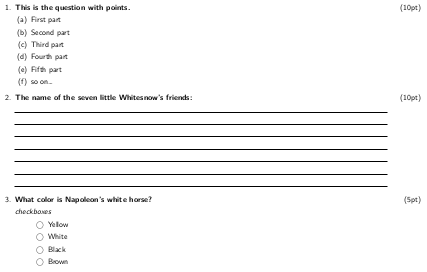
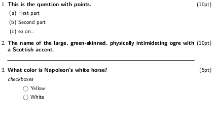

# MdExam
Lua filter to use `Latex Exam class` from markdown and produce beautiful class exam.

This filter is used by [Pandoc](https://pandoc.org/ "Pandoc Homepage") to produce LaTeX content based on [Exam document class](https://www.ctan.org/pkg/exam). So Pandoc have to be installed.

Modifing the LaTeX template the ouput file can customized. The output format can be either a pdf file or a LaTeX souce file.

## How it works

I've taken inspiration from [this](https://idrissi.eu/post/exam-template) idea, using the Pandoc citation sintax. The `@` character followed by an identifier that specify an `exam` environment or command.

Let's go trough the commands.

### Questions

A question is specified by `@q` syntax. The question points can be specified in square brakes,

`@q foo bar` this is a question.  
`@q [10] foo bar` this is a question with points

if a question is divided in parts, use `:::` at the begining and at the end of the parts' block. Each part is specified by `@p`.

```
q [10] This is the question with points.

:::parts
@p First part

@p Second part

@p so on...
:::
```

### Horizontal rule

`@hf` is trasformed in LaTeX `/hrulefill` command. It produces a rubber length which can stretch or shrink horizontally. It will be filled with a horizontal rule. In square brakets you can specify the number of horizontal rules.

```
@q [10] The name of the sea between Europe and Americas:

@hf

@q [10] The name the seven little Whitesnow friends:

@hf [7]
```

produces:


### Fill in the blank question

`@tf` produce `\fillin` command. In the square brakets you can specify two optional arguments. 

- the first optional argument is the answer to the question, which will be printed above
the line when answers are being printed
- the second optional argument is the length of line to be printed, if you want some
length other than the default. The value is in centimeters and the default value is 0,8cm.

```
@q [10] Fill in the blanks with the correct word from the list:

*quick*, *fox*, *lazy*

The @tf[quick] brown @tf[fox,5] jumps over the @tf[,1] dog
``` 
Result without answers:


Result with answer


### Checboxes

The `exam` class provide two kind of checboxes. The first type is rendered *in line* and its relative command is `\oneparcheckbox`, the second is rendered line by line and its relative command is `\checkbox`.

The `ExamLuaFilter` use `:::opcb` block for `oneparchecbox` and `:::cb` block for `checbox`. Each entries must start with `@c` (command `\choice` of `exam` class) or `@cc` (command `\correctchoice` of `exam` class).

```
@q[5] What color is Napoleon's white horse?

*One paragraph checboxes*

:::opcb
@c Yellow
@cc White
@c Black
@c Brown
@c Is not known
:::


@q[5] What color is Napoleon's white horse?

*checkboxes*

:::cb
@c Yellow
@cc White
@c Black
@c Brown
@c Is not known
:::
```

Result without answers:


Result with answer


### Empty box

The `exam` class permits to print an empty box using the `\makeemptybox`.
The `ExamLuaFilter` use `@eb` for  this command. In the square brakets you can specify one optional parameter that is the lenght of the box. The box is as wide as the current line. If the lenght is not specified, the default value is applied (5cm).


```
@q [5] Draw your favorite flower:
@eb[3]

@q [5] Draw your favorite animal:
@eb
```
Result:


## YAML preamble

In the markdown source document you can specify a preamble that configure the output document.
To make all wirks correctly, you need a specific latex template file. The template provided is for italian language speaking, but can be used as starting point.

In the preabble thare are the following variables:

- `title`: Specify the title of the document, is printed at very begining of the pdf output
- `printPoints`: Enable printing the points for each question
- `pointsTable.print`: Enable printing of the points table at the end of document
- `pointsTable.space`: Define the vertcal space between the last question and the points table
- `answer`: Print the exam with the answer, if provided.
- `special_version`: Print the special version of the exam. The special version can be a simplified version, starting from the same source file
- `spacial_fontSize`: The special verion can have a bigger font size, to help students. Thie field is optional.
```
---
title: "Example Exam sheet"
printPoints: true       # print points in round brakets for each question
pointsTable:
    print: true         # Print the table with points at the end of the exam
    space: 1cm          # vertical space between the last question and the points table
answer: false           # set to true to show answers
special_version: false
spacial_fontSize: 17pt  # special version font size (8pt, 9pt, 10pt, 11pt, 12pt, 14pt, 17pt, and 20pt)
---
```

## Special version

The same markdown source file can produce two different pdf. The text in `:::special` block will be printed only in the special version exam. The text in `:::nspecial` block will be printed only if `special_version` is set to false.

In the special version exam you can specify a bigger font size via the `spacial_fontSize` variable.

Example:

This markdown

```
@q [10] This is the question with points.

:::parts
@p First part

@p Second part

:::nspecial
@p Third part

@p Fourth part

@p Fifth part
:::

@p so on...
:::

:::nspecial
@q [10] The name of the seven little Whitesnow's friends:

@hf [7]
:::

:::special
@q [10] The name of the large, green-skinned, physically intimidating ogre with a Scottish accent.

@hf [1]
:::

@q[5] What color is Napoleon's white horse?

*checkboxes*

:::cb
@c Yellow
@cc White

:::nspecial
@c Black
@c Brown
:::

:::
```

With `special_version` set to *false* the result is:



With `special_version` set to *true* the result is:



## Command line

To obtain the output file from command line invoke:

```
pandoc --pdf-engine lualatex --template ExamLuaTemplate.tex --lua-filter ExamLuaFilter.lua --output Output.pdf InputFile.md

```

where `InputFile.md` is the markdown source file and `Output.pdf` is the output file. If you change the file extension in `tex`, Pandoc will output a LaTeX file.

At compile time, you can override the variables specified in the markdown file preamble, so, for example, you don't need ti edit the sourde firl to produce both the 'special version' and the 'normal version'. To do that specify in the command line the option `--metadata` followed by the variable name you want to set, the equal sign and the value.

```
--metadata special_version=true
```