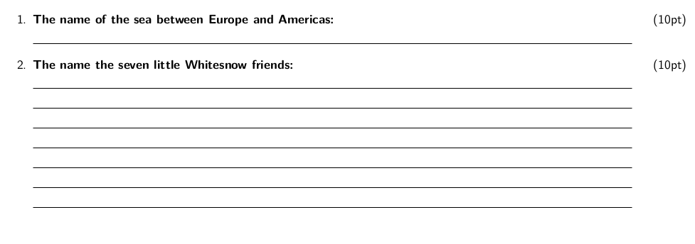
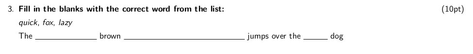
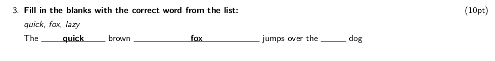
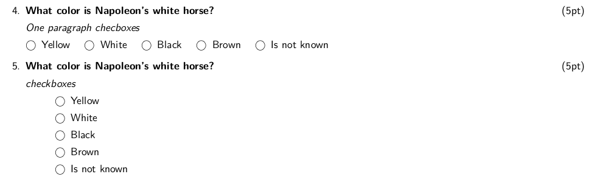
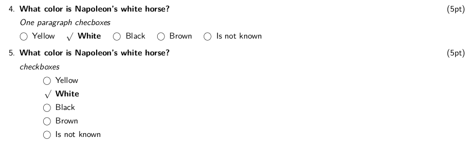
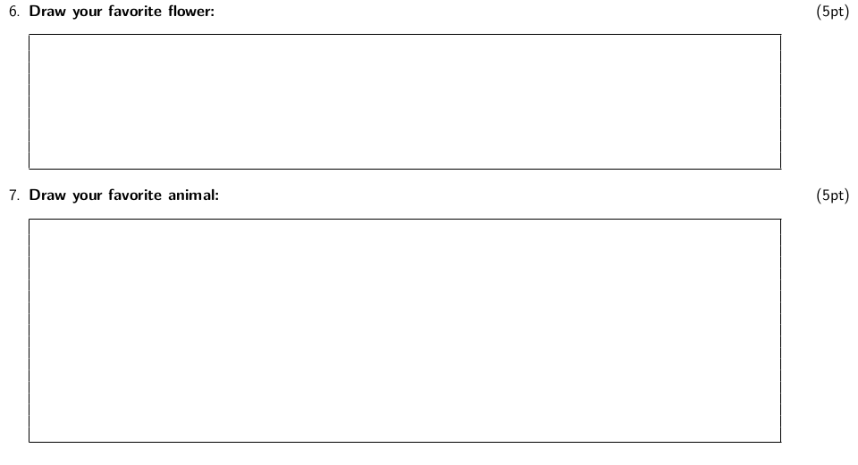

# MdExam
Lua filter to use `Latex Exam class` from markdown and produce beautiful class exam.

This filter is used by [Pandoc](https://pandoc.org/ "Pandoc Homepage") to produce LaTeX content based on [Exam document class](https://www.ctan.org/pkg/exam). So Pandoc have to be installed.

Modifing the LaTeX template the ouput file can customized. The output format can be either a pdf file or a LaTeX souce file.

## How it works

I've taken inspiration from [this](https://idrissi.eu/post/exam-template) idea, using the Pandoc citation sintax. The `@` character followed by an identifier that specify an `exam` environment or command.

Let's go trough the commands.

### Questions

A question is specified by `@q` syntax. The question points can be specified in square brakes,

`@q foo bar` this is a question.  
`@q [10] foo bar` this is a question with points

if a question is divided in parts, use `:::` at the begining and at the end of the parts' block. Each part is specified by `@p`.

```
q [10] This is the question with points.

:::parts
@p First part

@p Second part

@p so on...
:::
```

### Horizontal rule

`@hf` is trasformed in LaTeX `/hrulefill` command. It produces a rubber length which can stretch or shrink horizontally. It will be filled with a horizontal rule. In square brakets you can specify the number of horizontal rules.

```
@q [10] The name of the sea between Europe and Americas:

@hf

@q [10] The name the seven little Whitesnow friends:

@hf [7]
```

produces:




### Fill in the blank question

`@tf` produce `\fillin` command. In the square brakets you can specify two optional arguments. 

- the first optional argument is the answer to the question, which will be printed above
the line when answers are being printed
- the second optional argument is the length of line to be printed, if you want some
length other than the default. The value is in centimeters and the default value is 0,8cm.

```
@q [10] Fill in the blanks with the correct word from the list:

*quick*, *fox*, *lazy*

The @tf[quick] brown @tf[fox,5] jumps over the @tf[,1] dog
``` 
Result without answers:


Result with answer



### Checboxes

The `exam` class provide two kind of checboxes. The first type is rendered *in line* and its relative command is `\oneparcheckbox`, the second is rendered line by line and its relative command is `\checkbox`.

The `ExamLuaFilter` use `:::opcb` block for `oneparchecbox` and `:::cb` block for `checbox`. Each entries must start with `@c` (command `\choice` of `exam` class) or `@cc` (command `\correctchoice` of `exam` class).

```
@q[5] What color is Napoleon's white horse?

*One paragraph checboxes*

:::opcb
@c Yellow
@cc White
@c Black
@c Brown
@c Is not known
:::


@q[5] What color is Napoleon's white horse?

*checkboxes*

:::cb
@c Yellow
@cc White
@c Black
@c Brown
@c Is not known
:::
```

Result without answers:


Result with answer


### Empty box

The `exam` class permits to print an empty box using the `\makeemptybox`.
The `ExamLuaFilter` use `@eb` for  this command. In the square brakets you can specify one optional parameter that is the lenght of the box. The box is as wide as the current line. If the lenght is not specified, the default value is applied (5cm).


```
@q [5] Draw your favorite flower:
@eb[3]

@q [5] Draw your favorite animal:
@eb
```
Result:


